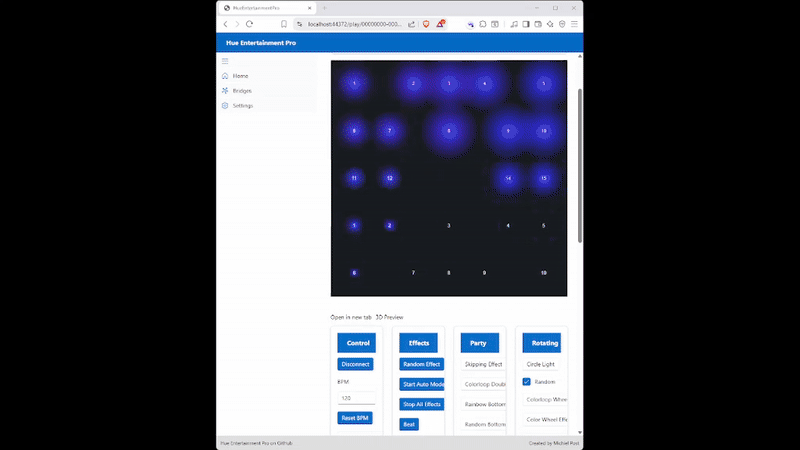
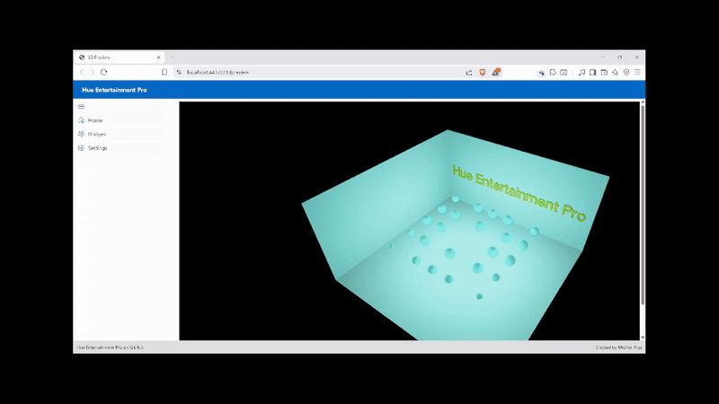
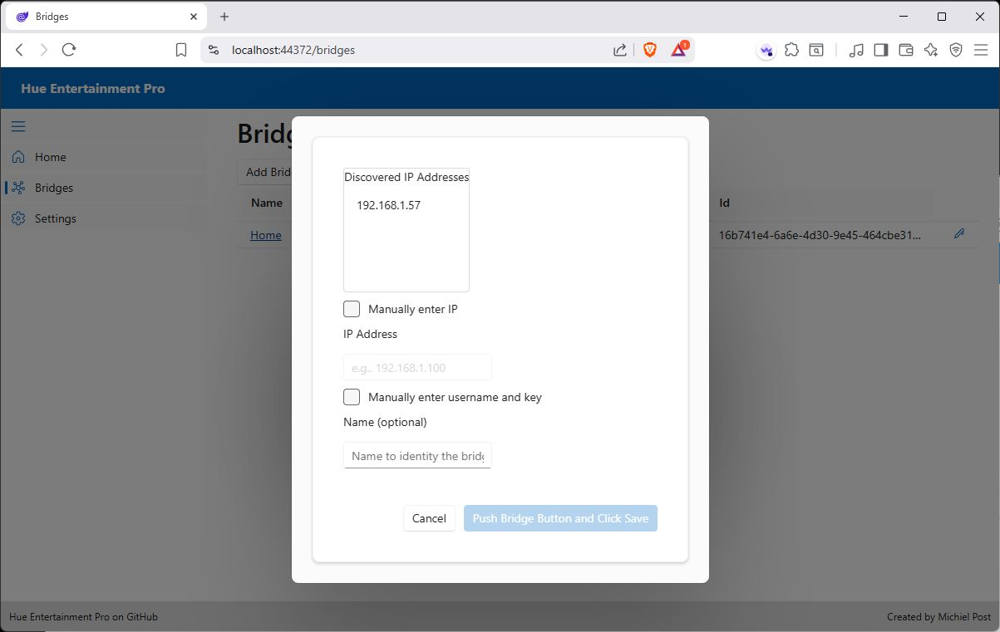
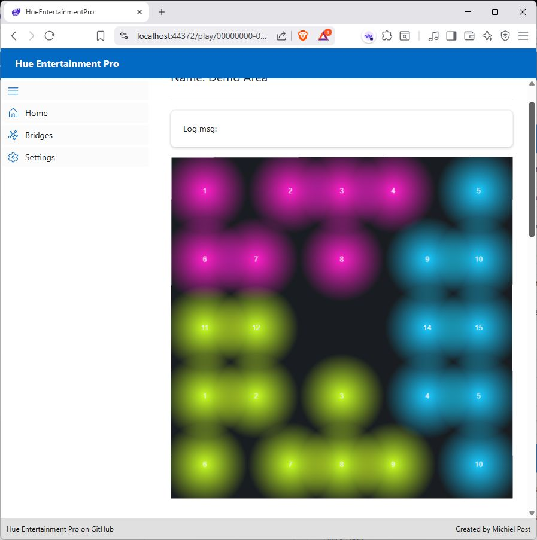
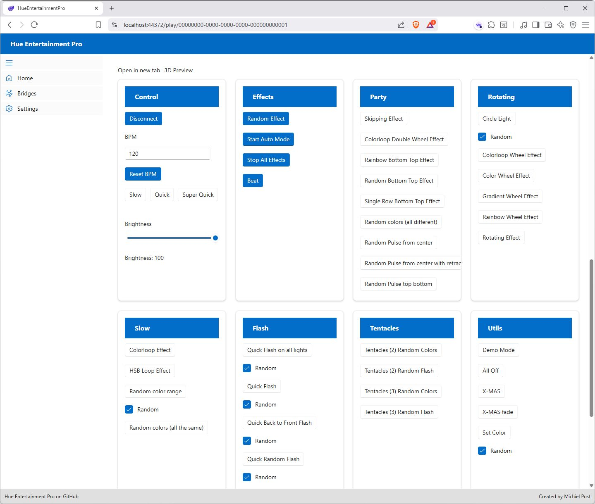
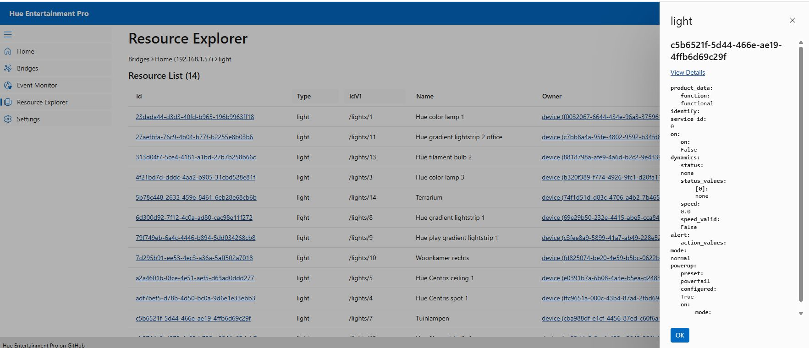

# Hue Entertainment Pro
Old name: Hue Light DJ

[](https://github.com/michielpost/HueLightDJ/actions/workflows/build.yml)

## What is it?
This web app can connect to multiple Philips Hue Bridges over the local network. It uses the Hue Entertainment API to update the lights almost instantly.

**Hue Entertainment Pro** is designed for setups with **multiple Philips Hue bridges**, allowing you to merge several entertainment areas into one seamless experience.

- Perfect for **large setups** with 20+ Hue lights  
- Works with **smaller setups** too (even under 5 lights)  
- Things get really fun once you pass **10+ lights** — give it a try  
- Includes a built-in **DEMO mode**, so you can preview how a 20+ light setup would look, even if you have fewer lights at home
- Includes a top down preview and a **new 3D preview**
- Hue Event Monitor to easily monitor events from your bridges
- Resource Explorer to view all data on your Hue Bridge

NOTE: The original [Hue Entertainment API](https://developers.meethue.com/entertainment-blog) supports max 20 lights in an Entertainment Group using the v2 API. To get this to work with more than 20 addressable lights, you need to have 1 bridge for every 20 lights. A led strip contains more than 1 addressable light (for example 3 or 5).
Using Hue Entertainment Pro, you can merge these areas into one area to apply effects to.



## Live Demo
NOTE: You can't use this demo to connect to your own bridge. But you can use the two included Demo Areas to view a simulation.  
DEMO:  [https://huelightdj.azurewebsites.net/](https://huelightdj.azurewebsites.net/)

### Demo with 32 Hue Light Strips on 5 bridges
[](https://vimeo.com/292273983) [](https://vimeo.com/290011309)

## Features
- Combine multiple entertainment areas into one
- Control multiple entertainment areas from multiple bridges at the same time
- Contains build in effects
- BPM input to specify speed of effects
- Preview window, to see the result of the effects
- New 3D Preview
- Random mode, runs a random effect on a random group
- Auto mode (Party Mode), starts a new random effect every 6 seconds
- Build in groups like front/back, left/right
- Random group, creates a new random group every time
- Touch effect, click or touch the preview area to start an effect from that position
- Brightness Slider to control overall brightness
- DEMO mode, to test the app without a Hue Bridge
- Connect to multiple Hue Bridges at the same time to control more than 20 lights 
- Uses SQLite for storage



## Tech
- ASP.Net Core 9.0 backend
- SignalR for realtime communication from server to client
- gRPC for client to server communication
- [HueApi](https://github.com/michielpost/Q42.HueApi) for communicating with the Hue Bridge
- Blazor frontend
- PixiJS for WebGL preview window
- ThreeJs for 3D preview
- SQLite for data storage

## **Build and Install Instructions**
- Make sure to have [.Net 9.0](https://dotnet.microsoft.com/download) installed to build this project (`dotnet build`)
- Run the HueEntertainmentPro.Server project(`cd HueEntertainmentPro\Server && dotnet run`) 
- Follow the instructions to link your bridge or use the DEMO setup

## Docker
https://hub.docker.com/r/michielpost/huelightdj/
```
docker pull michielpost/huelightdj
docker run -d -p 8080:8080 michielpost/huelightdj
```
Hue Entertainment Pro is now available on port 8080

## Build docker image locally
```
docker build -f HueEntertainmentPro/Server/Dockerfile -t hue-entertainment-pro:dev .
docker run --rm -p 8080:8080 hue-entertainment-pro:dev
```

### Docker Compose
This application uses SQLite for storage. To keep your data between upgrades, use docker compose to store the database file on it's own volume.

Example docker compose file:
```yml
services:
  hueentertainmentpro.server:
    image: ${DOCKER_REGISTRY-}michielpost/huelightdj
    build:
      context: .
      dockerfile: HueEntertainmentPro/Server/Dockerfile
    expose:
      - "8080" # Expose port 8080 to the reverse proxy
    volumes:
      - sqlite-data:/app/data
    restart: unless-stopped
    environment:
      - ASPNETCORE_ENVIRONMENT=Production
      - ConnectionStrings__DefaultConnection=Data Source=/app/data/HueEntertainmentPro.db;Cache=Shared
volumes:
  sqlite-data:
```

## Screenshots









### SQL / Entity Framework Migrations

Execute in `.`:

```ps
dotnet ef --startup-project HueEntertainmentPro\Server\HueEntertainmentPro.Server.csproj --project HueEntertainmentPro.Database migrations add MIGRATION_NAME
```

## Feature Wishlist
- Multi Bridge light location configuration (use the Hue App to configure your light positions)
- Keyboard shortcuts
- Effect Composer, try out new effects by selecting a group, IteratorMode and effect
- More build in effects
- Support for a hardware controller using WebMidi
- Listen to sound input


